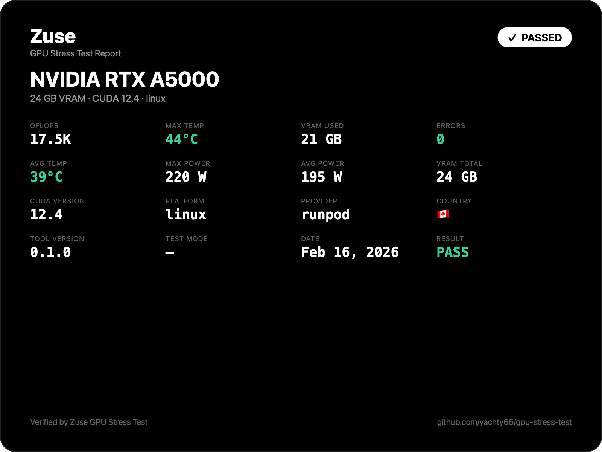
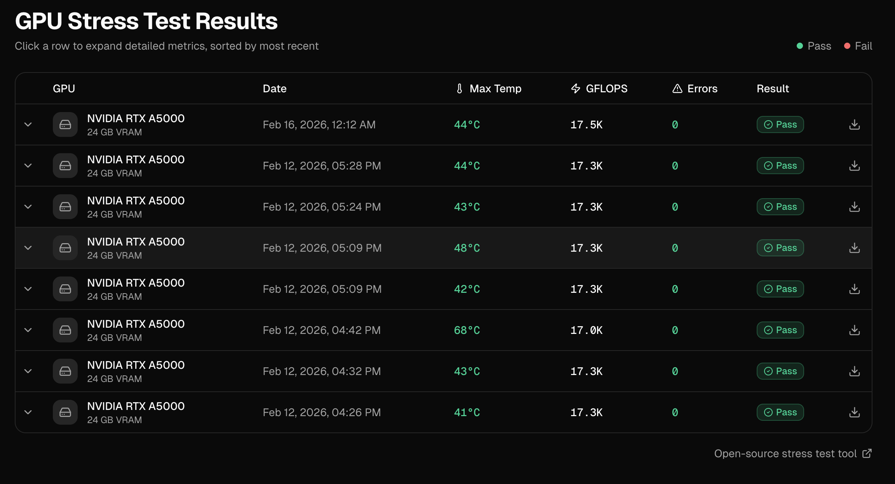

# GPU Stress Test

The goal is to build a SOTA stress test tool. At the beginning only a few features are implemented, but the goal is to make it a complete and feature-rich tool.

## How it works

- Fills GPU memory with large matrices of random floats
- Repeatedly multiplies them using cuBLAS (SGEMM/DGEMM) to max out the GPU
- Computes a reference result first, then compares every subsequent result against it
- If any element differs beyond a tiny epsilon, it's counted as a hardware error
- Monitors temperature and throughput (GFLOPS) throughout the test
- A healthy GPU produces zero errors — any errors indicate faulty hardware

## Features

- **CUDA Cores (FP32)** — massive matrix multiplications stress all floating-point units
- **GPU Memory (VRAM)** — fills ~90% of memory with matrices, exposing bad memory cells
- **Memory Bus** — constant read/write of large buffers tests bandwidth and data integrity
- **Temperature & Thermal Throttling** — monitors GPU temp throughout the test via NVML
- **Computational Correctness** — compares every result against a reference to catch silent data corruption
- **Sustained Load Stability** — runs for minutes to surface issues that only appear under prolonged stress


## How to run

**One-liner (recommended)** — installs dependencies, builds, and runs automatically:

```bash
curl -sSL https://raw.githubusercontent.com/yachty66/gpu-stress-test/main/run.sh | bash
```

For a quick 10-second test instead of the full 5-minute test:

```bash
curl -sSL https://raw.githubusercontent.com/yachty66/gpu-stress-test/main/run.sh | bash -s -- --quick
```

**Prerequisites:** NVIDIA drivers and CUDA toolkit must be installed. Everything else is handled automatically.

<details>
<summary>Manual build (if you prefer)</summary>

```bash
mkdir -p build && cd build && cmake .. && make -j$(nproc)
./gpu-stress-test --full    # 5 minute stress test
./gpu-stress-test --quick   # 10 second stress test
```

</details>

## CLI Options

| Flag | Description |
|---|---|
| `--full` | Run a 5-minute stress test |
| `--quick` | Run a 10-second stress test |
| `--offline` | Skip online result submission |
| `--json <file>` | Save results to a local JSON file |
| `-h, --help` | Show help |

**Examples:**

```bash
# Full test, submit online (default)
./gpu-stress-test --full

# Quick test, offline only, save results locally
./gpu-stress-test --quick --offline --json results.json

# Full test, submit online AND save a local copy
./gpu-stress-test --full --json results.json
```

## Online Dashboard & Leaderboard

All stress test results are automatically submitted to the online dashboard (unless `--offline` is used).

**View your results here:** [https://www.zusecompute.com/gpu-stress-test](https://www.zusecompute.com/gpu-stress-test)

- **Compare Performance:** See how your GPU stacks up against others globally.
- **Shareable Reports:** Generate a public link or download a certificate of your result.
- **Detailed Telemetry:** View max temperatures, error rates, and sustainment metrics.


## Tests

Todo but some sort of fault injection test where we inject faults into the matrices and see if the tool can detect them.

## Todo

- during the test collect max heat, avg heat, memory of the gpu, country, platform, cuda version, provider, gflops, errors, stress test version, default add result online, in the case user runs offline and online submission fails dont throw error - add optional flag for this ofc - 
- display benchmark results online - 
- make result sharable -
- make it possible to run the test from the CLI without the need for having deadass c++ dependencies - 

- GUI
- zero dependency installer
- PCIe bandwidth test (host↔device throughput)
- Double precision (FP64) and Tensor Core tests
- ECC error reporting via NVML
- JSON output for programmatic consumption -
- support for rocm amd
- Historical comparison (save results, compare across runs) & online leaderboard
- Multi-GPU support testing
